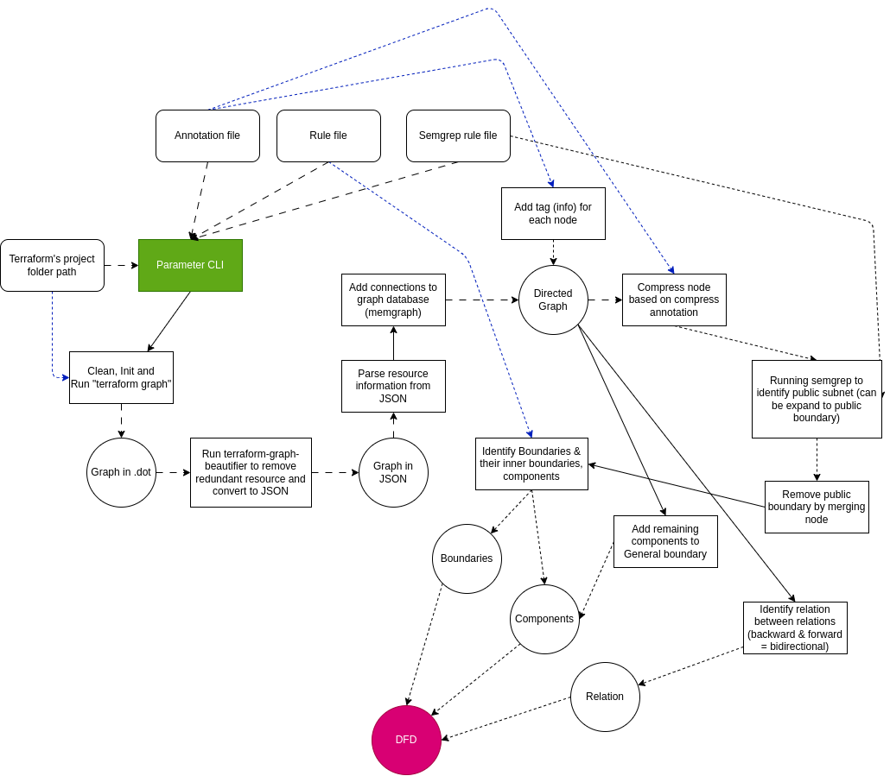

# AutoIaC
Automated App to convert IaCs scripts to DFD

## Sample architecture:


## Step
0. Run `memgraph` with: `docker compose -f ./memgraph-compose.yaml up`
1. Install Terraform CLI or OpenTofu manually or run `prepare.sh`
- https://developer.hashicorp.com/terraform/install?product_intent=terraform
- https://github.com/opentofu/opentofu
2. Install [Terraform Graph Beautifier](https://github.com/pcasteran/terraform-graph-beautifier) (Make sure the executable is accessible from PATH)

```
go install github.com/pcasteran/terraform-graph-beautifier@latest
```

3. Create new python virtualenv (venv, pipenv, ...)
4. Install dependencies
- `pip install -r requirements.txt`
6. Analyze with this tool
- `./main.py <terraform_project_path> -o <folder_path_to_store_dfd_dot> `
- `-o ..` part is optional, default to current directory output folder
- `--reinit=False` to disable project reinit (for second run)
- `-a`: specify path to annotation (default to `./input/aws_annotation.yaml`)
- `-s`: specify path to semgrep rule for public boundaries identification (default to `./input/semgrep_rule.yaml`)
- `--rule_path`: specify path to rule of relation (default to `./input/aws_rule.yaml`)
- `--graph_mode=True` to export graph instead of sparta


By default, program will seek for terraform executable, if you want to run the program with OpenTofu, use:
```bash
    TOFU=1; ./main.py ... # in bash
    set -x TOFU 1; ./main.py ... # in fish
```